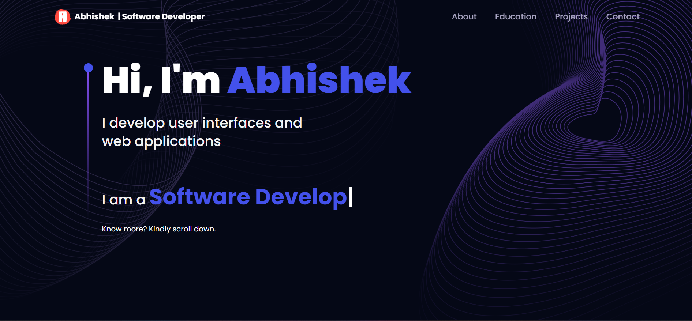

# Personal Portfolio

Welcome to my personal portfolio! This project showcases my skills, projects, and experiences as a software developer. It serves as a comprehensive introduction to who I am and what I can offer.

## Table of Contents

- [Introduction](#introduction)
- [Technologies Used](#technologies-used)
- [Features](#features)
- [Projects](#projects)
- [Getting Started](#getting-started)
- [Contact](#contact)

## Introduction

As a 4th-year BTech Computer Science student, I have developed a strong foundation in software development, particularly in web technologies. This portfolio highlights my work, projects, and skills, demonstrating my ability to create functional and visually appealing applications.

## Technologies Used

- HTML
- CSS
- JavaScript
- React
- Node.js
- Express.js
- MongoDB
- Tailwind CSS
- Styled Components

## Features

- **Responsive Design**: The portfolio is designed to be fully responsive, providing a seamless experience across all devices.
- **Project Showcases**: Each project includes a description, technologies used, and links to live demos or GitHub repositories.
- **Contact Form**: A built-in contact form allows visitors to get in touch with me directly.
- **Animations**: Smooth transitions and animations enhance the user experience.

## Projects

### [Project 1: Memory Game](https://github.com/yourusername/memory-game)
A fun and interactive memory game where players match cards.

### [Project 2: To-Do List App](https://github.com/yourusername/todo-list-app)
A full-stack to-do list application with user authentication and MongoDB integration.

### [Project 3: Food Suggestion App](https://github.com/yourusername/food-suggestion-app)
An app that suggests meals based on user preferences and dietary restrictions.

## Getting Started

To view my portfolio:

1. Clone the repository:
   git clone https://github.com/abhishek-ox/Personal_portfolio.git

2. Navigate to the project directory:
  
Here's a template for your personal portfolio project README file. You can customize it as needed:

markdown
Copy code
# Personal Portfolio

Welcome to my personal portfolio! This project showcases my skills, projects, and experiences as a software developer. It serves as a comprehensive introduction to who I am and what I can offer.

## Table of Contents

- [Introduction](#introduction)
- [Technologies Used](#technologies-used)
- [Features](#features)
- [Projects](#projects)
- [Getting Started](#getting-started)
- [Contact](#contact)

## Introduction

As a 4th-year BTech Computer Science student, I have developed a strong foundation in software development, particularly in web technologies. This portfolio highlights my work, projects, and skills, demonstrating my ability to create functional and visually appealing applications.

## Technologies Used

- HTML
- CSS
- JavaScript
- React
- Node.js
- Express.js
- MongoDB
- Tailwind CSS
- Styled Components

## Features

- **Responsive Design**: The portfolio is designed to be fully responsive, providing a seamless experience across all devices.
- **Project Showcases**: Each project includes a description, technologies used, and links to live demos or GitHub repositories.
- **Contact Form**: A built-in contact form allows visitors to get in touch with me directly.
- **Animations**: Smooth transitions and animations enhance the user experience.

## Projects

### [Project 1: Memory Game](https://github.com/yourusername/memory-game)
A fun and interactive memory game where players match cards.

### [Project 2: To-Do List App](https://github.com/yourusername/todo-list-app)
A full-stack to-do list application with user authentication and MongoDB integration.

### [Project 3: Food Suggestion App](https://github.com/yourusername/food-suggestion-app)
An app that suggests meals based on user preferences and dietary restrictions.

## Getting Started

To view my portfolio:

1. Clone the repository:
   git clone https://github.com/yourusername/personal-portfolio.git
   
2. Navigate to the project directory:
   cd personal-portfolio

3.Install dependencies:
   npm install

4.Start the development server:
   npm start

Contact
Feel free to reach out to me:

Email: abandil2003@gmail.com
LinkedIn: https://www.linkedin.com/in/abhishek-bandil/
